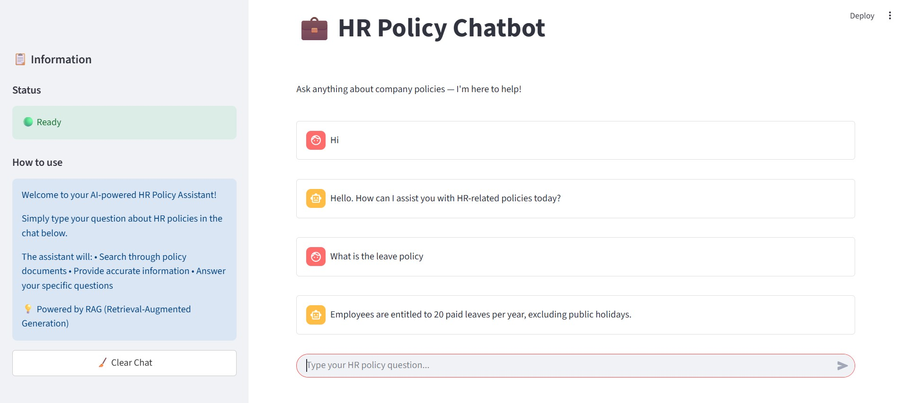

# 🤖 HR Policy Chatbot (RAG-based)

A conversational AI assistant that answers questions based on your company's HR policies. Built using **LangChain**, **Streamlit**, **ChromaDB**, and **Groq LLM** with **RAG (Retrieval-Augmented Generation)** architecture.

---

## 🔧 Features

- 🧠 Retrieval-Augmented Generation using LangChain
- 📂 Load and chunk structured JSON policy documents
- 🔍 Semantic search using Hugging Face embeddings & ChromaDB
- 💬 Modern Messenger-style chat UI using Streamlit
- 🧱 Modular codebase for clean architecture and easy reuse

---


# System Flow Chart




---

## 🚀 Getting Started

### 1. Clone the repository

```bash
git clone https://github.com/Arunpandeylaudari/HR_Policy_ChatBot-RAG.git
cd HR_Policy_ChatBot-RAG


```### 2. Create a virtual environment

```bash
python -m venv venv
source venv/bin/activate  # On Windows use `venv\Scripts\activate`
``` 
### 3. Install dependencies

```bash
pip install -r requirements.txt
```
### 4. Run the app

```bash
streamlit run app/hr_chatbot.py
```
